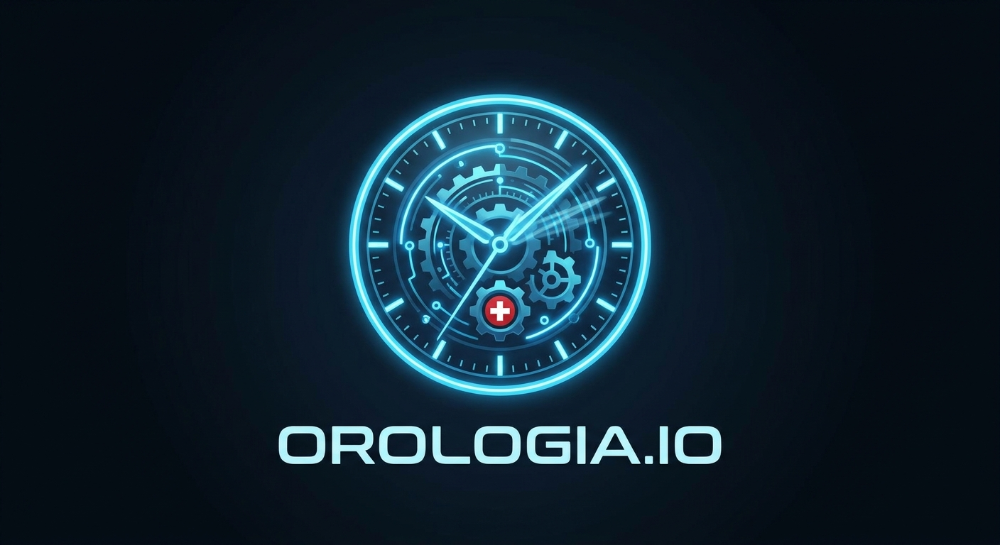

# Orologia.io (Codenamed: Time Master)

A mobile clock-learning game designed to teach children (Sebi and Alessandro) how to read analog clocks, update digital displays, and understand 7-segment digital watch digit configurations.

## Web Application Prototype
We have built a beautiful, fully interactive, single-page web application prototype directly inside the repository!

### Key Features
1. **Interactive Analog Clock**: Smoothly drag the hour hand or minute hand (dual-zone continuous dragging) and see the times and hands adjust in perfect synchronization.
2. **Game Modes**:
   - **Mode 1 (Analog ➔ Digital)**: Select the correct digital time matching the clock hands.
   - **Mode 2 (Digital ➔ Analog)**: Identify the correct clock face for a given digital target (including 24-hour PM conversions for older kids).
   - **Mode 3 (Interactive & Digital Display)**: Explore how clock hands update the digital time and visualize the active/inactive elements on a classic 7-segment digital watch display in real-time.
3. **Smart Distractor System**: Leverages algorithmic rules to prevent guessing ("A Usta") by generating extremely plausible wrong answers (e.g. swapping hands, off-by-one hour, or close minutes) appropriate for the selected difficulty.
4. **Educational Guides**: Offers a visual guide detailing the quarter sub-ticks between hours (🔵 :15, 🟡 :30, 🔴 :45), making the slow shifting of the hour hand intuitive.
5. **Aesthetics & Audio**: Gorgeous glassmorphism, responsive interface supporting both Light (Daylight) and Dark (Neon Space) themes, and synthesized cute Web Audio SFX (chime, buzzer, ticking, celebration) with zero external assets needed.

### How to Play
Simply open `solutions/20260615-antigravity-managed-agents/index.html` in any modern web browser!

## Solutions

We have multiple implementations of Orologia.io available:

1. **Antigravity Managed Agents Web Solution** (Vanilla JS):
   - **Path**: [solutions/20260615-antigravity-managed-agents/](solutions/20260615-antigravity-managed-agents/)
   - **Deployment**: Published to GitHub Pages (URL pending).
   - **Description**: A fully interactive, responsive clock-learning game featuring analog clock rotation, a 7-segment watch display, safe cracker combination lock, sound effects, and input diagnostics testing.

2. **Flutter Mobile Prototype** (Antigravity UI Solution):
   - **Path**: [solutions/antigravity2.0-multi-agent-flutter/](solutions/antigravity2.0-multi-agent-flutter/)
   - **Description**: A more complex Flutter-based UI solution that took 30 minutes to build, implementing the mobile transition specifications, and is being pushed to Google Play as we speak.

## Documentation
All product requirements and behavior specifications (Gherkin features) are documented in:
*   [docs/BDD.md](docs/BDD.md)

## Tech Stack
*   **Web Prototype:** HTML5, CSS3 (Custom properties, CSS Grid/Flexbox), Vanilla Javascript (ES6+, Web Audio API, SVG graphics).
*   **Mobile App Framework:** Flutter (Dart) - *PRD specifications aligned for mobile transition*.
