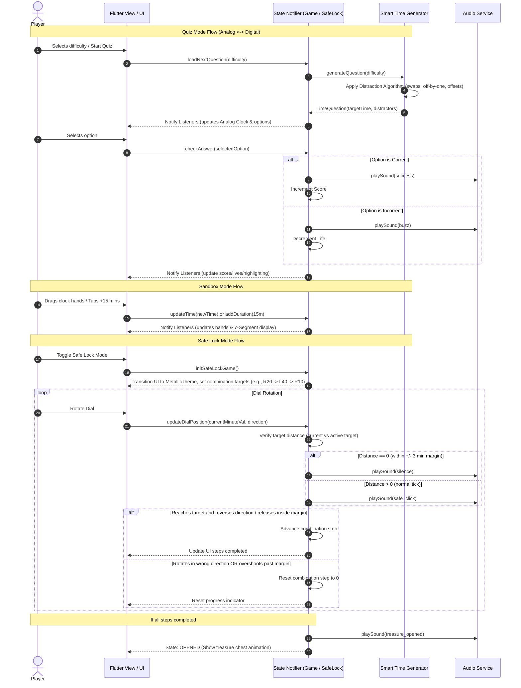

# Orologia.io Architecture Design

This document details the software architecture, state management flow, UI layouts, 
and core algorithms for the Orologia.io Flutter clock-learning game.

## 1. Directory Structure

A clean, feature-first structure for scalability and readability:

```
lib/
├── main.dart                  # App entry point & global notifier configuration
├── core/
│   ├── constants/             # Color palettes, text styles, size configurations
│   ├── theme/                 # Light, dark, and metallic safe themes
│   └── utils/                 # Clock angle converters & time math
├── models/
│   ├── difficulty.dart        # Easy, Medium, Hard level definitions
│   ├── time_question.dart     # Holds target times and MCQ options
│   └── safe_step.dart         # Target minute and target rotation direction
├── state/
│   ├── game_notifier.dart     # Global state (lives, total score, current level)
│   ├── quiz_notifier.dart     # Handles loading questions & checking answers
│   ├── sandbox_notifier.dart  # Interactive sandbox time addition/subtraction
│   └── safe_lock_notifier.dart# Safe Lock finite state machine
├── services/
│   ├── time_generator.dart    # Level generation & distraction algorithms
│   └── audio_service.dart     # System clicks, buzzer, and victory sound effects
└── views/
    ├── home/
    │   └── home_screen.dart   # Mode selection & settings menu
    ├── quiz/
    │   ├── quiz_screen.dart   # Main Multiple-Choice Quiz interface
    │   └── widgets/
    │       ├── analog_clock.dart # CustomPainter-drawn analog clock face
    │       └── option_card.dart  # Highlighted multiple-choice button
    ├── sandbox/
    │   ├── sandbox_screen.dart# Sandbox interaction screen
    │   └── widgets/
    │       ├── segment_display.dart # 7-segment digital time display
    │       └── sandbox_controls.dart# Add/subtract time buttons
    └── safe_lock/
        ├── safe_lock_screen.dart# Metallic safe dial game interface
        └── widgets/
            └── metallic_dial.dart # Custom Painter for the safe rotary dial
```

## 2. State Management Flow

We utilize Flutter's built-in `ChangeNotifier` and `ListenableBuilder` (or `AnimatedBuilder`)
for lightweight, performant, and boilerplate-free state management.

- **`GameNotifier`**: Manages app-wide user stats (lives, score, sound settings).
- **`QuizNotifier`**: Coordinates the state of the active MCQ. Interacts with the
  `TimeGenerator` to fetch levels, check answers, and decrement/increment score.
- **`SandboxNotifier`**: Manages the current time displayed in the Sandbox.
  Accepts user rotational input (dragging hands) or numeric offsets (+/- 15m, etc.)
  and notifies the UI to update the Analog Clock and 7-segment display.
- **`SafeLockNotifier`**: A state machine managing the movie-style combination sequence.

## 3. Core Algorithms & Logic

### 3.1 Smart Time Generator & Distraction Algorithm (Sistema di distrazione)
To prevent players from guessing ("A Usta"), the generator creates 3 plausible distractors
based on the correct time $(H_{target}, M_{target})$ and the active difficulty:

- **Easy Level:** Minutes are restricted to $\{0, 30\}$.
  - *Distractor 1:* Shift hour by $\pm 1$ (e.g., $03:30 \rightarrow 04:30$)
  - *Distractor 2:* Shift minutes by $30$ mins (e.g., $03:30 \rightarrow 03:00$)
  - *Distractor 3:* Double shift (e.g., $03:30 \rightarrow 04:00$)

- **Medium Level:** Minutes are restricted to $\{0, 15, 30, 45\}$.
  - *Distractor 1:* Shift hour by $\pm 1$ (e.g., $15:45 \rightarrow 14:45$)
  - *Distractor 2:* Shift minutes by $\pm 15$ mins (e.g., $15:45 \rightarrow 15:30$)
  - *Distractor 3:* Swap hour and minute indicators. If hands point near $(3, 9)$,
    it could generate $09:15$.

- **Hard Level:** Minutes can be any value in $[0, 59]$.
  - *Distractor 1:* Small minute offset (e.g., $07:43 \rightarrow 07:48$ or $07:38$)
  - *Distractor 2:* Hour shift (e.g., $07:43 \rightarrow 08:43$)
  - *Distractor 3:* Swap Hour and Minute ticks. If target is $04:25$ (Hour points to 4,
    Minute points to 5), swap the hand assignments to produce $05:20$.

### 3.2 7-Segment Display Logic
A custom widget, `SevenSegmentDigit`, draws 7 individual path segments (`a` to `g`):

```
     -- a --
    |       |
    f       b
    |       |
     -- g --
    |       |
    e       c
    |       |
     -- d --
```

A Boolean lookup list maps digits $[0-9]$ to active segments:

```dart
const Map<int, List<bool>> segmentConfigurations = {
  //         [a,     b,     c,     d,     e,     f,     g]
  0: [true,  true,  true,  true,  true,  true,  false],
  1: [false, true,  true,  false, false, false, false],
  2: [true,  true,  false, true,  true,  false, true],
  3: [true,  true,  true,  true,  false, false, true],
  4: [false, true,  true,  false, false, true,  true],
  5: [true,  false, true,  true,  false, true,  true],
  6: [true,  false, true,  true,  true,  true,  true],
  7: [true,  true,  true,  false, false, false, false],
  8: [true,  true,  true,  true,  true,  true,  true],
  9: [true,  true,  true,  true,  false, true,  true],
};
```

*Inactive segments are drawn with a very low opacity (e.g., `0.05`) of the active color
(e.g., digital green/red) to simulate physical LED elements.*

### 3.3 Safe Lock Mode State Machine
Safe Lock Mode transforms the screen into a metallic rotary dial. The player must enter
a 3-step combination (e.g., Right to 20, Left to 40, Right to 10).

```
   State: LOCKED (Step 0)
     |
     v [Rotate in correct direction]
   State: ROTATING (Current Step)
     |
     +---> [Distance to target <= 3 mins (5%)] ---> SILENCE clicks
     |
     +---> [Distance to target > 3 mins] ---------> PLAY click sound
     |
     +---> [Direction change/Release INSIDE target margin] ---> Advance Step
     |                                                             |
     |                                                             v
     |                                                    Is Step Index == 3?
     |                                                    /                 \
     |                                                 Yes                  No
     |                                                  /                     \
     |                                                 v                       v
     |                                          State: UNLOCKED       State: ROTATING (Next Step)
     |
     +---> [Direction change/Overshoot OUTSIDE target margin] ---> Reset Step Index to 0 & State: LOCKED
```

#### Directional Check:
The drag delta angle is used to identify the user's rotation direction (CW vs CCW).
If the direction differs from the target direction of the active step, the state immediately resets to `LOCKED` (Step 0).

## 4. UI Layout Design

- **Analog Clock View:**
  - Uses `CustomPainter` to draw the clock face, hours/minutes hand.
  - Features **12 distinct bumps (hour ticks)**.
  - Features **4 small markers (tacchettine)** at the quarter points to guide children's
    understanding of fractional hour hand movement.
- **Multiple-Choice Quiz Screen:**
  - Displays the Analog Clock at the top.
  - Displays 4 large digital option buttons (MCQ grid) at the bottom.
  - Displays score, lives, and visual/audio congratulations.
- **Sandbox Mode Screen:**
  - Interactive Analog Clock (players drag the hands).
  - 7-Segment display in the middle (updating live).
  - Time adjusters at the bottom (+/- 1h, +/- 15m, +/- 5m, +/- 1m) to easily experiment.
- **Safe Lock Screen:**
  - Metallic styling with a rotary safe dial.
  - Status display ("LOCKED" vs "OPENED") and combination markers (e.g. ◯ ◯ ◯).
  - Displays a glorious treasure chest when unlocked.

## 5. System Sequence Diagram



## 6. Comprehensive Unit and Widget Test Plan

This test plan defines the unit, widget, and integration test coverage for Orologia.io's core algorithms, state notifiers, and visual rendering widgets.

### 6.1 Unit Tests (State, Math, and Logic)

#### 6.1.1 TimeGenerator & Distractor Algorithms
- **Easy Level Generation:**
  - Verify that the target time has minutes restricted to {0, 30}.
  - Verify that exactly 3 unique distractors are generated.
  - Verify that distractor times have minutes restricted to {0, 30}.
  - Verify that distractors match the expected patterns: hour shift (+/- 1), minute shift (30 mins), or double shift.
- **Medium Level Generation:**
  - Verify that target and distractor minutes are restricted to {0, 15, 30, 45}.
  - Verify that swap hour/minute distractor generates the correct transposed hands (e.g. 03:45 transposes to 09:15).
- **Hard Level Generation:**
  - Verify that minutes can be any value [0, 59].
  - Verify that small minute offsets are between 1 and 5 minutes of target.
  - Verify that swap ticks logic transposes hands accurately.
- **Edge Cases & General Integrity:**
  - Ensure the target time is never included in the distractors.
  - Ensure all 4 options (correct answer + 3 distractors) are unique.
  - Test boundaries like rollover at midnight (23:45 -> 00:00, hour shifts at 12 or 24).

#### 6.1.2 GameNotifier (Global State)
- **Score Logic:**
  - Initial score is 0.
  - Score increases by a defined amount (e.g., 10 points) on correct answers.
  - Score never drops below 0.
- **Life Logic:**
  - Initial lives set to 3.
  - Lives decrement by 1 on incorrect answers.
  - Triggers game-over state/event when lives reach 0.
- **Settings:**
  - Sound effects toggle updates local state and saves preferences.

#### 6.1.3 QuizNotifier (Quiz Session State)
- **State Progression:**
  - Loading new question sets status to loading, then active.
  - Answering correctly updates status, increments score in GameNotifier.
  - Answering incorrectly updates status, decrements lives in GameNotifier.
  - Selecting an option blocks further taps until next question is loaded.

#### 6.1.4 SandboxNotifier (Sandbox Interactions)
- **Time Adjustments:**
  - Verify button offset functions (+1h, -1h, +15m, -15m, +5m, -5m, +1m, -1m) roll over correctly (e.g. adding 15m to 11:50 yields 12:05).
  - Drag gesture simulation: verify custom angle calculation maps clockwise/counter-clockwise drags to correct minute/hour values.

#### 6.1.5 SafeLockNotifier (Safe Lock State Machine)
- **Sequence Validation:**
  - Verify initialization creates a valid 3-step combination (e.g., Target 1, Target 2, Target 3 with alternating directions).
  - Verify state transitions from LOCKED to ROTATING.
  - Verify rotating in correct direction advances angle towards target.
  - Verify click sound triggers when distance > 3 mins.
  - Verify click sound is silenced (constant tick silent) when distance <= 3 mins.
  - Verify reversing direction inside the target margin (3 mins) advances step index.
  - Verify reversing direction outside the target margin resets step index to 0 and sets state to LOCKED.
  - Verify overshooting beyond the target margin resets step index to 0 and sets state to LOCKED.
  - Verify completing step 3 transitions state to UNLOCKED.

---

### 6.2 Widget Tests (UI and Custom Painters)

#### 6.2.1 AnalogClock
- **Component Layout:**
  - Verify that 12 hour ticks (bumps) and 4 quarter markers (tacchettine) are present on the clock face.
  - Verify hour and minute hand lengths/colors reflect the design specs.
- **Hand Rotation Accuracy:**
  - Given a target time (e.g., 03:30), verify the hour hand angle is exactly 105 degrees (90 degrees for 3 o'clock + 15 degrees for 30 minutes offset) and the minute hand is exactly 180 degrees.
  - Test edge cases like 11:59 to verify correct micro-movements of hands.

#### 6.2.2 SevenSegmentDigit
- **Segment State Mapping:**
  - Given a digit (e.g., 8), verify all 7 segment paths are rendered with full opacity.
  - Given a digit (e.g., 1), verify segments b and c are fully opaque, and segments a, d, e, f, g are drawn with inactive opacity (0.05).

#### 6.2.3 OptionCard
- **State Rendering:**
  - Verify initial state displays digital time string (e.g., "10:15").
  - Verify correct selection state triggers green border/highlight.
  - Verify incorrect selection state triggers red border/highlight.
  - Verify tap trigger executes callback handler.

